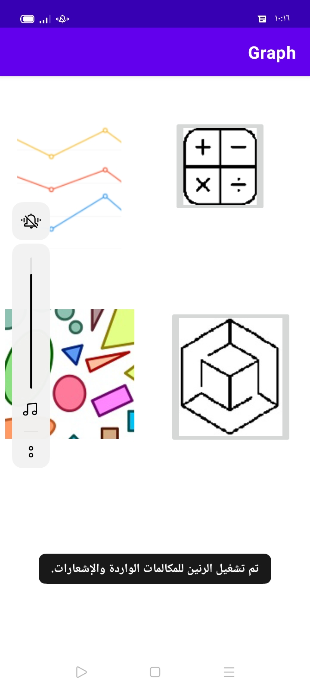
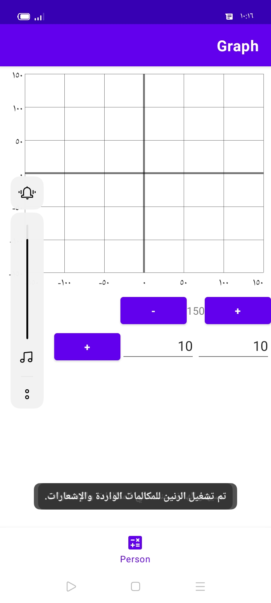
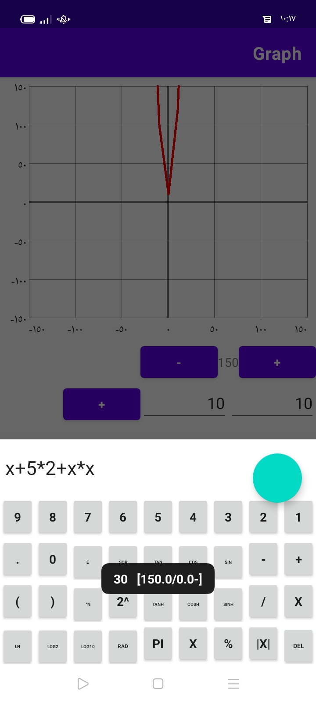
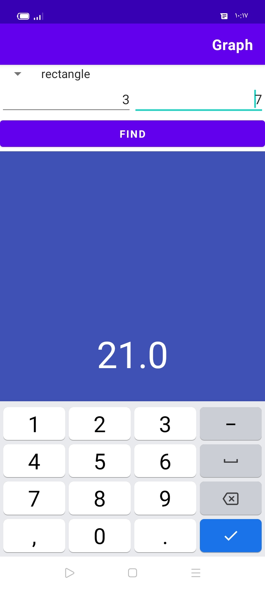
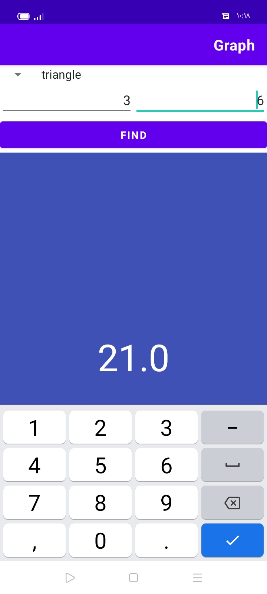

# graph-drawer-android-enter-the-math-equation-and-graph-will-be-drawn
# Graph Drawer

## Overview

Graph Drawer is an Android application that allows users to input mathematical equations and visualize the corresponding graphs. This tool is designed to help users better understand mathematical functions and their graphical representations.

## Features

- **Equation Input**: Enter mathematical equations using a user-friendly interface.
- **Graph Visualization**: Automatically draw and display the graph of the entered equation.
- **Interactive UI**: Allows users to interact with and explore the graph.

## Technologies Used

- Android SDK for application development
- Java/Kotlin for programming
- XML for user interface design
- Optional: Any additional libraries or frameworks used in the project

## Usage
1. Launch the Application: Open the app on your Android device or emulator.
2. Enter an Equation: Type a mathematical equation into the input field.
3. View the Graph: The app will automatically generate and display the graph of the entered equation.

   
* this app is for math and equation things

* you can enter equation and it will be drawn for you

* you can also calculate areas

